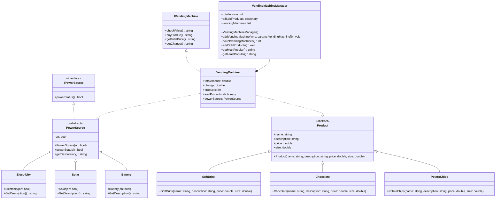

# Vending Machine - with OOP concepts

## Class Diagram

```mermaid
	classDiagram
	class IPowerSource {
		<<interface>>
		+powerStatus()  bool
	}
	
	IPowerSource <|.. PowerSource
	
	class PowerSource {
		<<abstract>>
		-on: bool
		+PowerSource(on: bool)
		+powerStatus() bool
		+getDescription()* string
	}
	
	PowerSource <|-- Electricity
	
	class Electricity{
		+Electricity(on: bool)
		+GetDescription() string
	}

	PowerSource <|-- Solar
	
	class Solar{
		+Solar(on: bool)
		+GetDescription() string
	}
	
	PowerSource <|-- Battery
	
	class Battery{
		+Battery(on: bool)
		+GetDescription() string
	}

	
	class Product {
		<<abstract>>
		+name: string
		+description: string
		+price: double
		+size: double
		+Product(name: string, description: string, price: double, size: double)
	}

	Product <|-- SoftDrink
	class SoftDrink {
		+SoftDrink(name: string, description: string, price: double, size: double)
	}
	
	Product <|-- Chocolate
	class Chocolate {
		+Chocolate(name: string, description: string, price: double, size: double)
	}

	Product <|-- PotatoChips
	class PotatoChips {
		+PotatoChips(name: string, description: string, price: double, size: double)
	}

	class IVendingMachine {
		+checkPrice() string
		+buyProduc() string
		+getTotalPrice() string
		+getChange() string
	}
	
	IVendingMachine <|.. VendingMachine
	class VendingMachine {
		+totalAmount: double
		+change: double
		+products: list<Product>
		+soldProducts: dictionary<string, int>
		+powerSource: PowerSource
	}

	class VendingMachineManager {
		+totalIncome: int
		+allSoldProducts: dictionary<string, int>
		+vendingMachines: list<VendingMachine>
		+VendingMachineManager()
		+addVendingMachine(vms: params VendingMachine[]) void
		+countVendingMachines() int
		+addSoldProducts() void
		+getMostPopular() string
		+getLeastPopular() string
	}

	VendingMachine ..o PowerSource
	VendingMachine ..o Product
	VendingMachineManager --* VendingMachine
```

